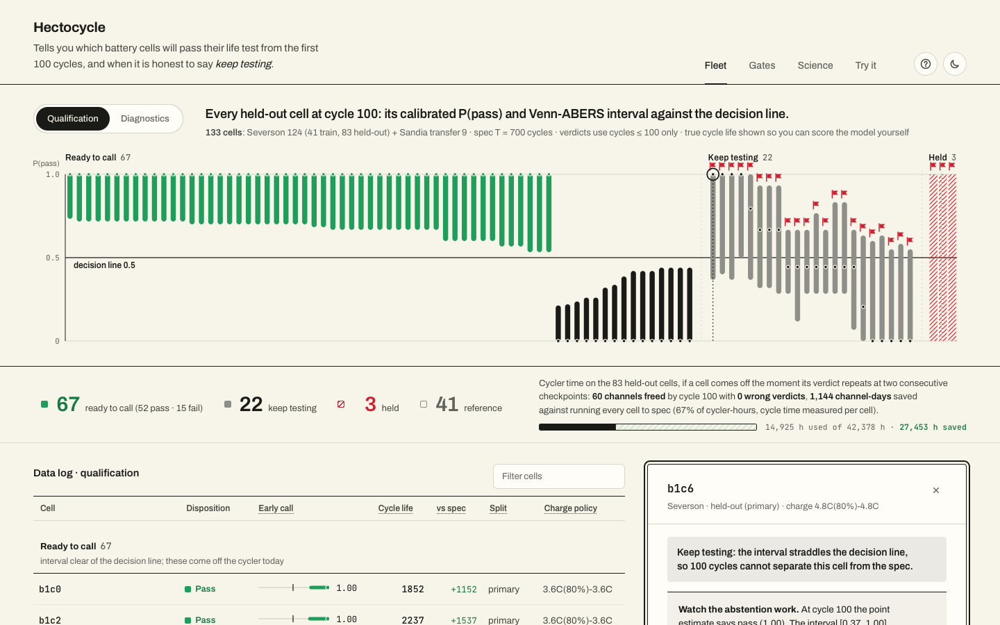
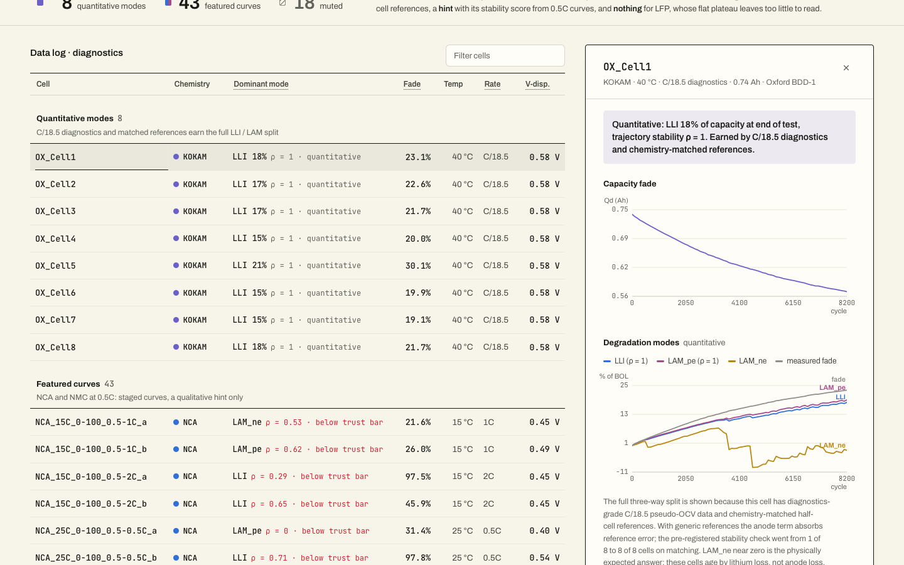
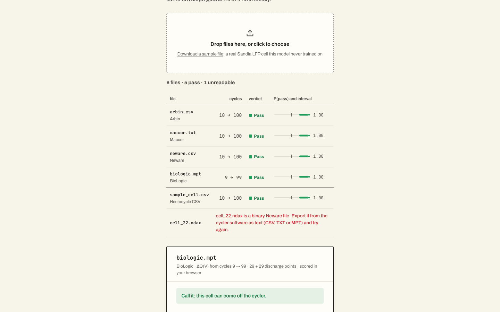

# Hectocycle

*Hecto-: the SI prefix for one hundred. One hundred cycles in, Hectocycle makes the call.*

A cockpit for cell qualification triage: **call pass/fail early — with honest confidence — or say "keep testing,"** plus chemistry-aware degradation diagnostics. Built gate-first: every feature shipped here survived a pre-registered falsifiable gate, and the validation studies in `docs/` document exactly where the methods break — and what it took to earn them back.

**[▶ Live demo](https://hectocycle.com)** — no install; runs on the precomputed bundle.

 



*The fleet as one control chart: every held-out cell is an interval bar on a shared 0–1 rail with the 0.5 decision line. A bar that clears the line is a call, a bar that crosses it is flagged KEEP TESTING, and the three cells the model refuses to score are red-hatched, the loudest marks on the page. Beneath the chart, the disposition line reports what the allocation policy does to cycler time: 60 of 83 channels freed, 0 wrong verdicts, 1,144 channel-days.*



*Degradation-mode attribution, earned tier by tier: with C/18.5 diagnostics and chemistry-matched half-cell references, the full LLI / LAM_pe / LAM_ne split passes the pre-registered stability gate on 8/8 cells (ρ = 1.00). Cells with only 0.5C data get a qualitative hint with its stability score, LFP cells are marked muted, and the UI never shows a number the gate didn't earn.*



*Drop raw exports from Arbin, Maccor, Neware or BioLogic cyclers, one file per cell, and get verdicts scored entirely in the browser by the exported production model. Binary formats get a plain instruction instead of a crash. The parser and scorer in `core.js` are checked against the Python pipeline in CI. Nothing is uploaded anywhere.*

## What's inside

| Study | Question | What ships |
|---|---|---|
| [Early call](docs/early-call-study.md) | Can ≤100-cycle data flip a qualification verdict reliably? | Calibrated P(pass) + Venn-ABERS interval + abstain rule. Production model uses **protocol-invariant ΔQ(V) features only** — the full feature set transfers 0/9 across labs, ΔQ-only transfers 9/9 — plus an out-of-envelope input guard |
| [Degradation modes](docs/degradation-modes-study.md) | Can 0.5C diagnostics support LLI/LAM attribution on NCA/NMC? | ICA/DVA curve tracking + fade-closure QC; mode split shown as a hint with its stability score — NCA decomposition is genuinely unidentifiable from 0.5C data (documented, not hidden) |
| [Mode identifiability](docs/mode-identifiability-study.md) | What earns quantitative modes back? | Three-tier answer on Oxford BDD-1 (C/18.5 pseudo-OCV): generic refs → LLI/LAM_pe stable (8/8, 6/8); **matched half-cell refs → full three-way split passes the pre-registered bar 8/8** |
| [Cycler allocation](docs/early-call-study.md#6-the-abstain-rule-as-a-cycler-allocation-policy) | Does the call change what the lab does? | The abstain rule scored as a stopping policy: pull a cell when its verdict repeats at two consecutive checkpoints. **60/83 test cells off the cycler by cycle 100, zero wrong verdicts, 67% of cycler-hours saved** vs run-to-spec (≈1,140 channel-days on this fleet). The greedy first-call rule saves 82% but ships two wrong verdicts — the multiple-look problem, measured, not assumed |
| [Out-of-sample batch](docs/out-of-sample-study.md) | Does the call hold on a batch it has never seen? | **No, and the failure is published.** On Attia et al.'s 2019 validation batch (same cell, stored longer), the frozen model fails its pre-registered gate: 5 wrong confirmed calls, ECE 0.27. The ΔQ signal still *ranks* cells (ρ = −0.83) but lives sit 18% below the Severson map, a silent shift no input guard can see. Verdicts stay scoped to calibrated batches |
| [Spec threshold](docs/spec-threshold-study.md) | Can one model answer any spec, not just 700 cycles? | **Not yet.** A jackknife+ life model covers 93% (90% nominal) but its intervals are ~555 cycles wide, so at T=700 it saves 42% of cycler time vs the classifier's 67% and the pre-registered gate kills the spec slider. Off-distribution it is the robust one: 0–1 wrong calls per threshold on batch 4 where the classifier made 5 |
| [Closed-loop selection](docs/closed-loop-study.md) | Can the early signal pick the next protocol to test? | **It ranks; the loop falls just short.** On batch 4's 9 protocols the predictor ranks them ρ = 0.88 despite a 30% level shift. Replayed campaigns find a top-cluster protocol with a third of run-to-failure's channel-days, short of the pre-registered quarter |
| Browser scoring | Can you try it on your own cells? | **TRY IT tab**: drop raw cycler exports (**Arbin** CSV, **Maccor** text, **Neware** CSV, **BioLogic** .mpt, or a 3-column CSV), one file per cell, as many as you like, and get verdicts scored entirely in the browser. Parsing and scoring live in `core.js`, checked against the Python pipeline in CI (`tests/js/parity.mjs`: features to 1e-9, scores to 1e-6). Same thing from the shell: `scripts/score_files.py` |

## Chemistry targeting

The datasets mirror a Tesla-relevant chemistry portfolio: **NCA** (Panasonic NCR18650B — the 18650/2170 workhorse family), **NMC** (LG HG2, LiNi0.84Mn0.06Co0.10 — the 2170/4680 family), and **LFP** (A123 — the CATL-sourced base-trim family). The engine is chemistry-aware by design: it quantifies *why* LFP diagnostics are muted (capacity moves in a 0.16 V band vs 0.5–0.6 V for the nickel chemistries) rather than pretending one method fits all. A natural extension is Dahn-lab-lineage NMC data — Dalhousie's published degradation-analysis methods are the reference point for the electrode-alignment approach used here.

## Data

- **Severson/MATR** (124 LFP cells, early-life prediction): `data.matr.io` (open at time of writing; exact file URLs in `src/data.py`)
- **Sandia/SNL** (61 NCA/NMC/LFP cells, Preger et al. 2020, double-attribution license): BatteryLife processed mirror, [Zenodo 19688272](https://zenodo.org/records/19688272) → `SNL.zip` → `data/snl/SNL/`
- **Oxford BDD-1** (8 Kokam pouch cells, C/18.5 pseudo-OCV diagnostics, Birkl & Howey 2017): [ORA](https://ora.ox.ac.uk/objects/uuid:03ba4b01-cfed-46d3-9b1a-7d4a7bdf6fac) → `data/oxford/` (optional; the bundle builder skips the Oxford fleet if absent)
- Half-cell OCP references vendored in `refs/ocp/` from PyBaMM parameter sets (Chen 2020, Kim 2011, Ecker 2015, Afshar 2017) and SLIDE's matched Kokam curves — all BSD-3, attribution in `LICENSE` and `src/ocp_refs.py`

## Run it

```bash
python -m venv .venv && .venv/bin/pip install -r requirements.txt
# place datasets per above, then:
.venv/bin/python scripts/build_bundle.py      # precompute cockpit_data.json (~4 min)
.venv/bin/uvicorn app.main:app --port 8377    # open http://127.0.0.1:8377
```

The frontend is a no-build static SPA; `app/static/` also works on any static host.

Score your own cycler exports without the browser:

```bash
.venv/bin/python scripts/score_files.py cell_01.csv cell_02.mpt   # table; --json for machine output
```

The newer studies each have one script that prints its gate result: `scripts/out_of_sample.py` (needs the 2019 batch file, URL in `src/matr_b4.py`), `scripts/spec_threshold.py`, `scripts/closed_loop.py`.

Study notebooks: `notebooks/early_call_study.ipynb`, `notebooks/degradation_modes_study.ipynb` — each runs top-to-bottom on a fresh checkout and prints its result.
