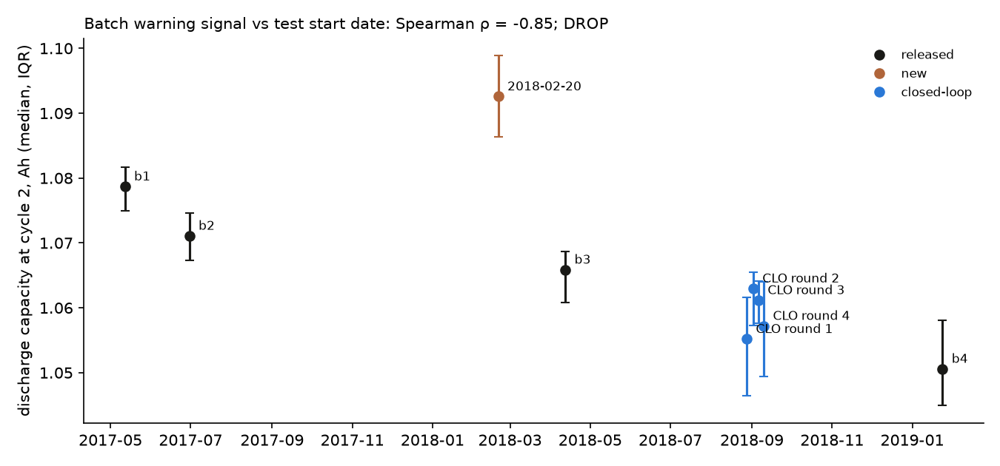

# Batch Warning Study

*Is low cycle-2 capacity a usable warning that a batch has shifted?*

**Question:** batch 4, whose lives sat 18% below the model's map (out-of-sample study), also had the lowest discharge capacity at cycle 2 of any batch: median 1.051 Ah, against 1.065–1.078 for batches 1–3. That fits calendar aging: batch 4 was stored longest before testing. With four batches, it is one data point.

This study asks two things:
- whether the signal is **stable** within a campaign;
- whether it **tracks calendar time** across the lab's batches.

Stability is what makes it usable as a warning. Calendar tracking is what would explain it.

**Data.**
- The four released batches.
- The four closed-loop rounds of Attia et al. 2020, released on data.matr.io, 185 cells cycled to 100 cycles and started 2018-08-28 to 2018-09-10.
- The 2018-02-20 batch and the small 2018-04-03 "varcharge" batch, from the public MATR bucket (`publications.matr.io/1/final_data/`).

The cell is the same A123 APR18650M1A throughout. Attia et al. give lot EL1508007-R for their cells; the Severson batches' lot is not stated.

## 0. Pre-registration (committed before any of the new files was opened)

**What was seen before this section was written:**
- the four released batches' median cycle-2 capacities: b1 1.0784, b2 1.0717, b3 1.0653, b4 1.0506 Ah
- the new files' names, sizes and upload dates

**Signal:** the median across a batch's cells of discharge capacity at cycle 2 (`summary.QD[1]`). A batch counts if at least 10 cells have a cycle-2 value.

**Hypotheses and pass bars:**

| | Hypothesis | Pass bar |
|---|---|---|
| H1 | **Stable within a campaign.** The four closed-loop rounds started within 13 days of each other. | Range of their medians ≤ 0.007 Ah, half the b3 → b4 gap |
| H2 | **Tracks calendar time.** Across all qualifying batches, the signal falls with test start date. | Spearman ρ(start date, median) ≤ −0.7 |
| H3 | **Placement.** The closed-loop rounds started between b3 (April 2018) and b4 (January 2019). | Every round's median lies between b4's and b3's (1.0506–1.0653 Ah) |

**Decision rule:**
- **H1 fails:** the signal is too noisy to be a warning. It is dropped from the lot report.
- **H1 passes, H2 fails:** stable but unexplained. It stays a descriptive line in the lot report, gating nothing.
- **H1 and H2 pass:** the signal behaves like a calendar-age proxy. The lot report states it as one, still gating nothing.

Turning it into a detector would need lots with known outcomes on both sides, which is the batch-recalibration study's job.

**Scope:** this is about cycle-2 capacity only. No life label from any new batch is read here. The 2018-02-20 batch's lives belong to the batch-recalibration study (§4 there), which runs first.

## 1. Result: **DROP**. The signal tracks calendar time but is too noisy to warn

Scored once by `scripts/batch_warning.py` (output in `figures/batch_warning.json`). Nine batches qualify; the 2018-04-03 "varcharge" file has only 2 cells and is excluded.

| Hypothesis | Result | Bar | |
|---|---|---|---|
| H1: stable within a campaign (four closed-loop rounds, 13 days apart) | range **0.0078 Ah** | ≤ 0.007 | ❌ |
| H2: falls with test start date (9 batches) | Spearman ρ = **−0.85** | ≤ −0.7 | ✅ |
| H3: the closed-loop rounds sit between b3 and b4 | all four, 1.0552–1.0630 Ah | between 1.0506 and 1.0653 | ✅ |

### **OFFICIAL DECISION: DROP**

The signal is removed from the lot report.

**What the numbers say.**
- **The trend is real.** Cycle-2 capacity falls steadily from May 2017 to January 2019, and the closed-loop rounds land exactly where storage time predicts. That is what calendar aging would do.
- **The trend is too gentle for a warning.** Four rounds started within two weeks of each other already spread by 0.0078 Ah, about half the b3 → b4 gap. A lot shifted as much as batch 4 would sit barely outside ordinary round-to-round noise.
- **The 2018-02-20 lot breaks the trend.** At 1.093 Ah it is above every earlier batch, so plausibly a fresher cell lot. Yet in the batch-recalibration study its offset was ordinary and its trouble was heterogeneity. A high reading didn't mean safe, and batch 4's low reading was the only case where low meant shifted.

**Consequence:** cycle-2 capacity is kept as a *description* of calendar age in this study only. It is not reported per lot and gates nothing. Detecting a shifted lot still needs cells that reach end of life, which is what the pilot cells are for.
