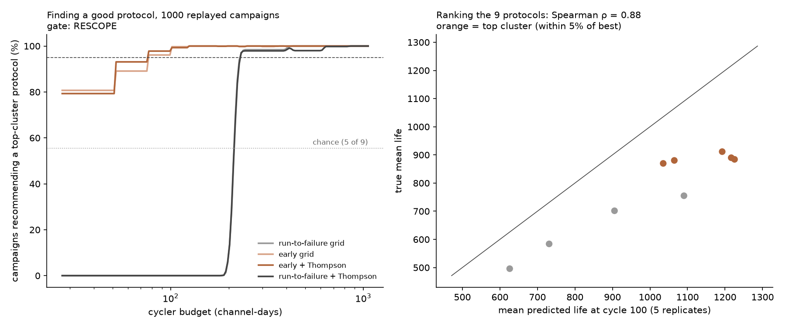

# Closed-Loop Protocol Selection Study

*If the early signal can't issue verdicts on a new batch, can it still choose which protocol to test next?*

**Question:** the out-of-sample study found that the ΔQ(V) signal loses its *level* on batch 4 (lives 18% shorter than predicted) but keeps its *ranking* (ρ = −0.83). Choosing between fast-charge protocols only needs ranking.

This study asks whether an early-prediction-driven experiment loop finds a good protocol for far less cycler time than running cells to failure. It is the question Attia et al. (2020) answered with Bayesian optimization over 224 protocols, replayed here offline on data the predictor has never seen.

**Arena:** batch 4, 9 protocols × 5 replicate cells, each run to end of life. Each protocol's *true* life is its 5-replicate mean. The predictor is trained on Severson cells only, so every observation in the simulation is out of sample.

## 0. Pre-registration (committed before any per-protocol prediction was computed)

**What was seen before this section was written:**
- b4 true lives and per-protocol means: 912, 890, 884, 880, 870, 755, 702, 584, 496.
- The *classifier's* per-protocol mean P(pass) (out-of-sample study §2).
- b4 cycle durations (median 43.8 min/cycle).

No life-model prediction had been aggregated by protocol, and no campaign had been simulated.

**Target:**
- The **top cluster** is the set of protocols whose true mean life is within 5% of the best (≥ 0.95 × 912 = 866): five protocols, 912 / 890 / 884 / 880 / 870. The next is 755, 17% below the best.
- With 5 replicates and a within-protocol spread of about ±100 cycles, the members of the top cluster are not distinguishable from each other even with every cell run to failure. The practical question is whether the loop avoids the four clearly worse protocols.
- **Picking at random lands in the top cluster 5/9 = 56% of the time**, so the bar below is set well above chance.

**Predictor:**
- The jackknife+ life model from the spec-threshold study (`src/life_model.py`), point prediction at cycle 100, trained on the 41 Severson training cells.
- Its gate failed for *verdicts*; here it is used only as a ranking signal inside the simulator, which is exactly what this gate tests.
- Observation noise for the bandit is fixed at the model's training leave-one-out residual SD in log₁₀ life, known before any b4 prediction.

**Simulator (`src/campaign.py`):**
- **Campaigns:** 8 channels, filled in rounds of 8 cells.
- **Drawing cells:** testing protocol k draws one of its 5 replicate cells without replacement. Once all 5 are used, it draws with replacement.
- **Cost** is in **channel-cycles**: 100 per early-called cell, or the cell's true life if run to failure. Channel-days = channel-cycles × 43.8 min / 1440.
- **Recommendation:** the protocol with the highest mean observed log-life. Every strategy opens with one cell per protocol (9 cells) so every protocol is observed.
- **Strategies:**
  1. **Run-to-failure grid:** round-robin; each cell observes its true life.
  2. **Early grid:** round-robin; each cell costs 100 cycles and observes the predicted life.
  3. **Early + Thompson sampling:** after the opening round, each channel goes to a protocol drawn by Gaussian Thompson sampling (known noise as above, prior N(log₁₀ 800, 0.3²)). Same cost and observation as strategy 2.
  4. *(Descriptive only)* run-to-failure + Thompson sampling.
- **Runs:** 1,000 seeded campaigns per strategy, with budgets up to the whole batch run to failure once (Σ true lives).

**Gate:**

| Check | Pass bar |
|---|---|
| Protocol ranking: Spearman ρ between per-protocol mean predicted life (all 5 replicates) and true mean life | ≥ 0.70 |
| Budget: B₃ ≤ 0.25 × B₁ | pass/fail |

Bₛ is the smallest budget at which strategy s recommends a top-cluster protocol in ≥ 95% of campaigns. If strategy 1 never reaches 95% within the maximum budget, B₁ is set to the maximum budget. If strategy 3 never reaches it, the budget check fails.

**Decision rule:**
- Both pass: **BUILD**. The loop gets a surface in GATES: regret vs channel-days for each strategy.
- Ranking passes, budget fails: **RESCOPE**. The ranking result is reported, but no loop claim is made.
- Ranking fails: **KILL**.

**Descriptive, not gated:** mean regret curves, strategy 2 vs 3 (does adaptivity help beyond cheap observations?), and strategy 4.

## 1. Result: **RESCOPE**. The ranking holds; the budget saving falls short of the bar

Scored once by `scripts/closed_loop.py` (1,000 campaigns per strategy, 8 channels; output in `figures/closed_loop.json`).

| Check | Result | Bar | |
|---|---|---|---|
| Protocol ranking, Spearman ρ (predicted vs true mean life, 9 protocols) | **0.88** | ≥ 0.70 | ✅ |
| Budget to recommend a top-cluster protocol in 95% of campaigns: early + Thompson (B₃) vs run-to-failure grid (B₁) | **2,533 vs 7,641 channel-cycles** (77 vs 232 channel-days): **ratio 0.33** | ≤ 0.25 | ❌ |

### **OFFICIAL GATE DECISION: RESCOPE**

The early signal ranks protocols it has never seen. The loop finds a good protocol for a third of the cycler time of running cells to failure, but not the quarter the gate asked for, so no loop claim ships.

**Ranking under shift.** The predictor over-estimates *every* protocol's life by about 30%: predicted 626–1,225 against true 496–912. This is the batch-level shift from the out-of-sample study, and it doesn't matter for ranking.
- All four protocols below the top cluster are ranked below all five top-cluster protocols, except one.
- The exception is 3.6C-6C-5.6C-4.755C (true 755, predicted 1,091), which sits above two top-cluster members.
- That one inversion is what keeps the early strategies from 95% in their opening round.

**Why the budget check missed.**
- **The arena is easy for run-to-failure.** The top cluster is 17% clear of the next protocol, so a single run-to-failure cell per protocol already recommends a top-cluster protocol 95% of the time. B₁ is essentially the opening round.
- **The early strategies start fast but need more cells.** After their 9-cell opening round (900 channel-cycles) they are at 81%, against 56% for chance. They need about 16 more early-called cells to clear 95%, because the misranked 755-cycle protocol keeps winning some opening draws.
- **Adaptivity didn't help at this scale.** Thompson sampling and round-robin reach 95% at the same budget. With 9 protocols and 8 channels a round-robin revisits every protocol about once per round anyway; the bandit's advantage shows up in large spaces (Attia's 224), not here.

## 2. Descriptive results

- **Calendar time, not gated.** An early observation takes 100 cycles (about 3 days at 43.8 min/cycle). A run-to-failure observation on this batch takes 443–1,166 cycles (13–35 days). Run-to-failure cannot recommend anything until its whole opening round has died, so the early loop's advantage in *wall-clock* time is larger than its channel-day ratio. The gate was on channel-days, and that is the number that failed.
- **Mean regret** (true life lost against the best protocol) for early + Thompson: 4.9% after its opening round, **2.7%** at its 95% budget. The residual is the spread *within* the top cluster, which no strategy can resolve with 5 replicates.

## 3. What this changes

- **In the cockpit:** the ranking result is reported (GATES, out-of-sample card). There is no closed-loop surface.
- **For the science:** the out-of-sample study's split holds up on independent evidence. On a new batch the early signal is unfit to issue *verdicts* but fit to *order* protocols (ρ = 0.88).
- **For a harder test:** a pre-registered replay on a space where run-to-failure is expensive to cover, such as Attia's closed-loop rounds, is where the bandit would have to earn its keep. Those rounds have no end-of-life labels, which is why this study used the validation batch.
