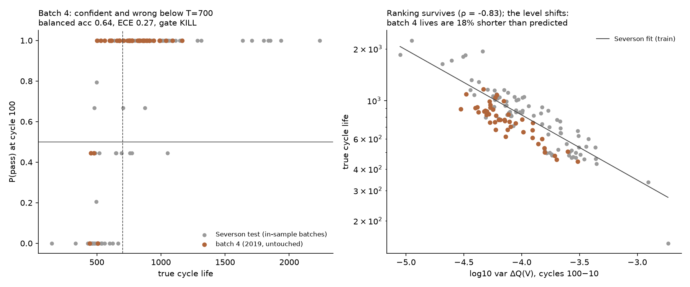

# Out-of-Sample Validation Study

*Does the early call hold on cells it has never seen, from a batch run a year later?*

**Question:** the early-call study ([early-call-study.md](early-call-study.md) §2) ended at "RESCOPE → BUILD, pending revalidation of calibration on untouched data". Every number so far comes from the three Severson batches, and the only cross-lab check (SNL LFP, §5 there) is single-class. This study is the pending revalidation.

**Data:** MATR batch 4 ("b4"): Attia et al. 2020 (*Nature* 578, 397) validation batch, via the BatteryLife processed mirror ([Zenodo 19688272](https://zenodo.org/records/19688272), `MATR.zip`). 45 A123 APR18650M1A cells (same cell model as Severson), 9 closed-loop-optimized fast-charge protocols × 5 replicates, same 4C discharge, 30 °C, run to 80% of nominal capacity. The cells sat on the shelf longer before testing than batches 1–3, and Attia's own early predictor over-estimated their lives. That makes this a real distribution shift, not a resample.

## 0. Pre-registration (committed before any b4 feature was computed)

**What was seen before this section was written:** the BatteryLife life-label distribution for b4 (45 cells, 442–1081 cycles, 14 below T = 700). This is needed to confirm the test is two-sided. No b4 voltage curve, feature, or prediction had been computed.

**Model under test:** the production model exactly as shipped in the cockpit. That means ΔQ(V)-only `EarlyVerdictModel` (point probability) + cross Venn-ABERS interval, trained on the 41 Severson training cells, T = 700, cutoff cycle 100, envelope guard with 10% margin. No refit, no recalibration, no feature change after this commit.

**Featurizer pre-condition (not the gate):** b4 comes as raw per-cycle curves, while the model was trained on Severson's pre-interpolated `Qdlin`. The raw-curve featurizer must first reproduce the `Qdlin` features on the Severson cells in the same mirror (b1–b3): median |Δ| < 0.05 on each of the three log-features and Spearman ρ > 0.98. If it fails, the featurizer is fixed (on b1–b3 only) before b4 is scored.

**Labels:** cycle life = first cycle after cycle 1 where discharge capacity < 0.88 Ah and stays below at the next cycle (the `src/data.py` rule), cross-checked against BatteryLife's labels; any disagreement > 5 cycles is reported.

**Gate (b4, n = 45, refused cells excluded from the metrics but counted):**

| Metric | Pass bar |
|---|---|
| Balanced accuracy of the point call @ 100 | ≥ 0.85 (same bar as the original gate) |
| ECE of the point probability @ 100 (10 bins) | ≤ 0.10 (same bar) |
| Accuracy on cells the interval calls @ 100 | ≥ 0.90 |
| Confirmed-call allocation policy (`src/policy.py`) wrong verdicts | ≤ 1 |
| Cells refused by the envelope guard | ≤ 15 (one third) |

**Decision rule:**
- All five pass: **BUILD**. b4 joins the cockpit as a validated fleet.
- Calibration (ECE) fails but called-accuracy and the policy pass: **RESCOPE**. The interval and abstain product stands, and the point probability is labelled in-domain only.
- Called-accuracy or the policy fails: **KILL** for cross-batch use. The early call is shown only for Severson-like batches, and the failure is published here.

**Descriptive, not gated:**
- Direction of bias (predicted vs true life).
- Callable curve across cutoffs 40–100.
- Allocation-policy savings on b4.
- Per-protocol error.

## 1. Result: **KILL** for cross-batch verdicts

Scored by `scripts/out_of_sample.py` (full output in `figures/out_of_sample.json`). The frozen model was scored once, with no changes after the pre-registration commit.

| Metric (b4, 41 scored + 4 refused) | Value | Pass bar | |
|---|---|---|---|
| Balanced accuracy of the point call @ 100 | **0.64** | ≥ 0.85 | ❌ |
| ECE @ 100 | **0.27** | ≤ 0.10 | ❌ |
| Accuracy on cells the interval calls @ 100 | **0.78** (32/41 called) | ≥ 0.90 | ❌ |
| Confirmed-call policy wrong verdicts | **5** | ≤ 1 | ❌ |
| Refused by the envelope guard | 4 | ≤ 15 | ✅ |

### **OFFICIAL GATE DECISION: KILL** for cross-batch use.

The early call is a verdict for batches like the ones it was calibrated on, and this study shows exactly why that qualifier is necessary.



**How it fails.** Every wrong verdict is a fail cell called PASS.
- The five cells the confirmed-call policy would have pulled wrongly have lives of 608–678 cycles, all within about 90 cycles below T.
- They span four different protocols.
- The model gave each of them P(pass) = 1.00.

Mean predicted P(pass) on b4 is 0.92, against a true pass rate of 0.66. The model is overconfident, in the same direction Attia et al. reported for their own early predictor on this batch.

**Why it fails: the level shifts, the ranking doesn't.** The Severson "variance model" (log life vs log var ΔQ(V), fit on the train split) behaves differently on the two sets:

| | Severson test | Batch 4 |
|---|---|---|
| Spearman ρ, log var ΔQ vs life | −0.89 | **−0.83** |
| True life ÷ predicted life (geometric mean) | 1.01 | **0.82** |
| Mean absolute % error | 15% | 18% |

The ΔQ(V) signal still orders b4 cells almost as well as it orders Severson's. What moved is the mapping from signal to cycles: at the same ΔQ variance, b4 cells die about 18% sooner.
- They look *healthier* at cycle 100 (mean log var ΔQ −4.12 vs −3.68 in training) and still fail earlier.
- The likely cause is the one Attia's team gave: longer calendar storage before testing, which ages the cell in a way the first 100 cycles don't reveal.

**Why the guard didn't catch it.** Only 4 cells left the feature envelope, and those 4 left it on the *mean* ΔQ, not the variance. The shift is silent: every input looks in-distribution while the relationship underneath has changed.

An input-envelope guard cannot detect this kind of shift, even in principle. That's the lesson this study adds to the SNL finding (early-call study §5):
- **Protocol covariates break loudly.** The input is 50σ out of range, and the guard catches it.
- **Batch history breaks silently.** Only labels can catch it.

## 2. Descriptive results (not gated)

**Callable curve on b4.** Accuracy *falls* as the cutoff grows: the model grows more confident about the wrong level.

| Cutoff | 40 | 50 | 60 | 80 | 100 |
|---|---|---|---|---|---|
| Called | 46% | 73% | 76% | 78% | 88% |
| Accuracy on called | 95% | 87% | 87% | 84% | 78% |

**Allocation policy.**
- Confirmed-call saves 76% of cycler-cycles on b4, but with 5 wrong verdicts. On Severson it saved 67% with 0 wrong.
- First-call saves 84%, with 8 wrong.
- The saving is not worth having at that error rate.

**Per protocol.** The model's mean P(pass) is 1.00 for 8 of 9 protocols, including one whose five cells average 584 cycles and all fail. Only the harshest protocol (8C-7C-5.2C-2.68C, mean 496) gets a low probability.

**Labels.** 43/45 cycle lives match BatteryLife's labels exactly, after BatteryLife's end-of-life index offset of one cycle. Two disagree: b4c38 is 1166 here vs 1055 there, and b4c40 is 1089 vs 871. Both are far above T, so no label is affected.

**Deviation from §0, disclosed.** The featurizer pre-condition did not apply. b4 was taken from MATR's own `.mat` release (data.matr.io file `5dcef152110002c7215b2c90`), not the BatteryLife mirror, because the mirror was throttled to under 1 MB/s. That file carries Severson's pre-interpolated `Qdlin`, so b4 goes through *exactly* the training featurizer, and the raw-curve parity check had nothing to check.

## 3. What this changes

1. **In the cockpit:** verdicts stay scoped to the calibrated batches. b4 appears in GATES as a failed gate with this diagnosis, not as a fleet of verdicts.
2. **For a lab:** a new production batch should be treated as uncalibrated until a few of its cells have run to end of life. Because ranking survives, a shift of this kind is a single offset in log life, which a handful of anchor cells could estimate. That recalibration is an open question here, and it would need its own pre-registered gate.
3. **For protocol selection** ([closed-loop study](closed-loop-study.md)): choosing between protocols needs *ranking*, not calibrated levels. The signal that fails as a qualification verdict here may still be fit to pick the next experiment. This is Attia et al.'s point, and it is tested there.

## Reproduce

```bash
# data/2019-01-24_batchdata_updated_struct_errorcorrect.mat (URL in src/matr_b4.py)
.venv/bin/python scripts/out_of_sample.py
```
