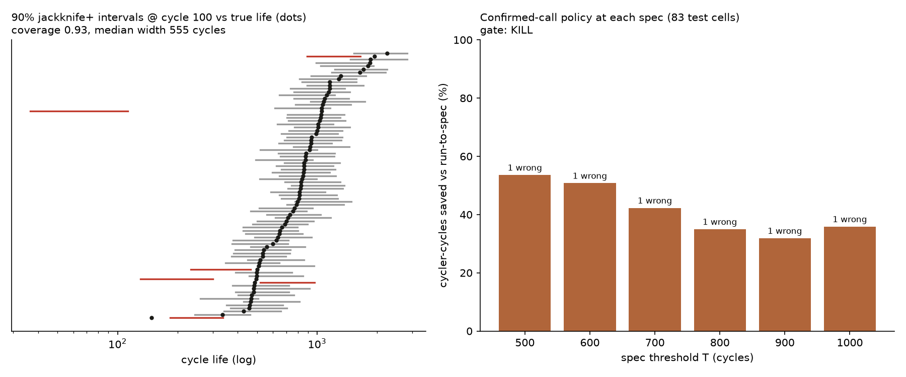

# Spec-Threshold Study

*Can one model answer "will it pass?" for any spec a lab sets, not just 700 cycles?*

**Question:** every verdict in the cockpit is fixed to one spec, T = 700 cycles: labels, isotonic map, Venn-ABERS calibration sets and the allocation policy. Real labs set their own spec. Training one classifier per threshold would cost a model per T. It can also contradict itself, calling a cell PASS at T = 800 and FAIL at T = 750.

**Approach:** replace "P(life ≥ T)" with a prediction interval on life itself, and derive every threshold's verdict from that one interval:
- **pass** if lo ≥ T
- **fail** if hi < T
- **keep testing** otherwise

The verdict is monotone in T by construction.

## 0. Pre-registration (committed before any life-model prediction on a test cell)

**What was seen before this section was written:**
- The early-call study's own results.
- The out-of-sample study's diagnosis, which fit a *univariate* log-var model on the train split and reported its error on the Severson test set (15% MAPE) and on batch 4. That is a peek at a close relative of the model below, and it is disclosed here.

No multivariate life-model interval had been computed on any test cell.

**Model (`src/life_model.py`):**
- Ordinary least squares of log₁₀(cycle life) on the three ΔQ(V) features (`DQ_FEATURES`).
- Fit on the 41 Severson training cells.
- **Jackknife+ prediction intervals** (Barber, Candès, Ramdas & Tibshirani 2021) at nominal 90%:
  - Fit the 41 leave-one-out models and record each left-out cell's absolute residual Rᵢ.
  - For a new cell with prediction μ₋ᵢ(x) from each leave-one-out model:
    - lo = the ⌊α(n+1)⌋-th smallest of {μ₋ᵢ(x) − Rᵢ}
    - hi = the ⌈(1−α)(n+1)⌉-th smallest of {μ₋ᵢ(x) + Rᵢ}
    - with α = 0.10 and n = 41.
- The same envelope guard as the classifier applies.
- The same checkpoint cutoffs (40, 50, 60, 80, 100) are used, refit per cutoff, feeding the same confirmed-call policy (`src/policy.py`).

**Gate (Severson test set: 43 primary + 40 secondary = 83 cells):**

| Check | Pass bar |
|---|---|
| Empirical coverage of the 90% interval @ 100 | ≥ 0.85 |
| At T = 700: confirmed-call wrong verdicts | ≤ the shipped classifier's (0) |
| At T = 700: cycler-cycles saved | ≥ 90% of the classifier's saving (≥ 0.603) |
| Every T ∈ {500, 600, 700, 800, 900, 1000}: confirmed-call wrong verdicts | ≤ 2 of 83 |

**Why 500–1000.**
- The regression is fit on life itself, so it needs no per-threshold class balance: training lives span 300–2160 cycles.
- What limits T is whether the *test* can falsify a threshold. Across 500–1000 the 83 test cells have at least 15 on each side (at T = 500: 68 pass, 15 fail; at T = 1000: 25 pass, 58 fail).
- For reference, the training split has only 4 cells passing at T = 1000. A per-threshold classifier would be starved there, which is part of why this study uses one regression.

**Decision rule:**
- All pass: **BUILD**. The life model drives a spec slider over 500–1000, and the Venn-ABERS classifier stays as the T = 700 reference in GATES.
- Coverage and the T = 700 checks pass, but some grid thresholds fail: **RESCOPE**. The slider is limited to the thresholds that passed.
- Coverage or the T = 700 checks fail: **KILL**. The cockpit stays at T = 700 only.

**Descriptive, not gated:**
- Coverage and per-T wrong verdicts on batch 4. Given the out-of-sample study, low coverage is expected; it is reported, not tuned for.
- Interval width in cycles.

## 1. Result: **KILL**, so the cockpit stays at T = 700

Scored once by `scripts/spec_threshold.py` (full output in `figures/spec_threshold.json`).

| Check (Severson test, n = 83) | Life model | Bar | |
|---|---|---|---|
| Coverage of the 90% interval @ 100 | **0.93** | ≥ 0.85 | ✅ |
| T = 700 wrong verdicts (confirmed-call) | **1** | ≤ 0 (the classifier's) | ❌ |
| T = 700 cycler-cycles saved | **42%** | ≥ 60.3% (90% of the classifier's 67%) | ❌ |
| Wrong verdicts at each T ∈ {500 … 1000} | **1** at every T | ≤ 2 | ✅ ×6 |

### **OFFICIAL GATE DECISION: KILL**

The interval is honest but too wide to earn the product. The spec slider does not ship as a validated feature.

**Why.** The intervals *cover*: 93% against a 90% nominal. But they are wide, with a median width of 555 cycles at cycle 100. That is roughly ±30% around a typical life, set by the 41-cell training split and the leave-one-out residuals.
- A wide interval straddles more thresholds, so fewer cells are called: 39 of 83 at T = 700, against the classifier's 60.
- The saving drops from 67% to 42%.

The Venn-ABERS classifier is more decisive at T = 700 because it only has to answer one question, which side of 700, not where the cell will end up.

**The one wrong call** is the same cell at every threshold: b1c41, which lived 1,051 cycles. Its cycle-100 ΔQ(V) is extreme enough that the regression extrapolates its life to about 40–110 cycles, and the confirmed-call rule pulls it as a FAIL. This is also the cell the classifier's greedy first-call rule got wrong in the allocation study. It is an outlier in feature space, not a threshold effect.

## 2. Descriptive: batch 4 turns the comparison around

On batch 4 (41 cells inside the envelope), where the classifier failed its own gate with 5 wrong confirmed calls at T = 700, the life model does much better:

| | Coverage @ 100 | Wrong at T = 500 / 600 / 700 / 800 / 900 / 1000 |
|---|---|---|
| Batch 4 | 0.78 | 0 / 0 / 1 / 0 / 1 / 0 (at T = 700: 13 of 41 called, 30% saved) |

Its coverage drops under the silent shift (0.78, against 0.93 in-sample), but the wide interval absorbs most of the 18% level shift instead of committing to a side of the line.

This makes the trade-off concrete:
- **A decisive model is fragile off-distribution.**
- **A robust model is indecisive on it.**

Neither is a free lunch at n = 41.

## 3. What would earn the slider back

A slider needs intervals that are both valid and narrow.

**Narrow** needs more training cells or a better signal, not a different wrapper.
- Jackknife+ width is set by the leave-one-out residuals of a 41-cell regression.
- The early-call study's classifier gets its decisiveness from answering one threshold, not from a better signal.

**What would move it:** retraining on Severson train plus batch 4, once a batch-offset term is in the model, since the out-of-sample study shows the offset is real. That is a new model and needs a new pre-registered gate and fresh cells, not a tweak to this one. It is recorded here as the open path, not taken.
